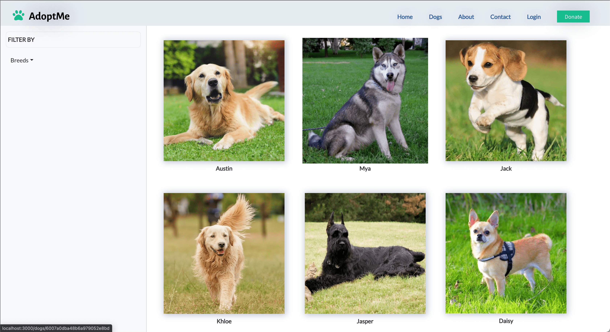

# Adopt Me

## Description

**Adopt Me** is a website for a dog shelter where users (site visitors) can adopt the dogs.

## Table of Contents

- [Deployment URL](#Deployment-URL)
- [Repo URL](#Repo-URL)
- [Features](#Features)
- [Pre-Requisites](#Pre-Requisites)
- [Installation](#Installation)
- [Usage](#Usage)
- [Screenshot](#Screenshot)
- [Technologies Used](#Technologies-Used)
- [Credits](#Credits)
- [Roadmap](#Roadmap)
- [Questions](#Questions)
- [License](#License)

## Deployment URL

https://adopt-me-hameed1239.herokuapp.com/.

## Repo URL

https://github.com/hameed1239/adopt-me.

## Features

1. Sensitive API key info is protected on the server using `dotenv`.
1. MongoDB Collections:
   1. Dogs.
   1. Taxonomy (classification).
   1. Users.
   1. Orders.
   1. Shopping Cart (DB or local storage?).

## Pre-Requisites

1. Install `node.js`.
1. Install `MongoDB`.
1. Create a database in a service such as `Atlas` on [mongodb](https://cloud.mongodb.com/).

## Installation

1. In the root directory of the app, run `npm i`.
1. Run `npm run seed` to seed the database.
1. Run `npm start`.

## Usage

1. Home page: is the Landing page
2. Dogs page: is the page that shows the list of dogs with a filter option for the breed type. You can get more information including the option to adopt or donate on a dog by clicking on the dog.
3. About page: is the page that gives more information about the adoption agency.
4. Contact page: is where you can fill out a contact form.
5. Login page: is the page that gives the user the option to login or signup for an account.
6. Donate page: is the page that gives you an option to donate.
7. Admin page: This requires that you have admin access. You can test this by login in with username: `admin1@test.com`, password: `password`.

## Screenshot

## Technologies Used

1. HTML5
1. CSS3
1. JavaScript
1. Node.js
1. MongoDB
1. Mongoose ODM
1. React
1. Redux
1. GraphQL
1. Authentication:
   1. Sessions
   1. JWT (Jason Web Tokens)
1. Stripe (Payment Platform)
1. PWA

## Collaborators

| DEVELOPER                                            | ROLE                | CONTRIBUTIONS                                                                 |
| ---------------------------------------------------- | ------------------- | ----------------------------------------------------------------------------- |
| [AADITI PAI](https://github.com/aadi1988)            | Project Manager     | User/Admin authentication (JWT), admin page and Application form.             |
| [AHMAD EL GAMAL](https://github.com/ahmadelgamal)    | Front-end Developer | UI Design (HTML & CSS) and Contact Form.                                      |
| [HAMEED KAZEEM](https://github.com/hameed1239/)      | Back-end Developer  | Repo, MongoDB, Mongoose ODM, Seeds file, GraphQL & Database API & Deployment. |
| [RONGBANG (BRYAN) YE](https://github.com/rongbangye) | Front-end Developer | React and Redux.                                                              |
| [SHAWNA GOHEL](https://github.com/shawnagohel)       | Back-end Developer  | Wireframes and Stripe Payment platform.                                       |
| [SOLOMON MERESA](https://github.com/solomonmeresa)   | Front-end Developer | UI, GraphQL & PWA.                                                            |

## Roadmap

1. Add `emailjs` to generate emails when adopters submit an application form.
1. Add Footer.
1. Optimize Picture Sizes.
1. Add `rootAdmin` in addition to existing `admin`.
1. Allow admin sign up for separate admin accounts, pending `rootAdmin` approval, or by receiving a link from the `rootAdmin`.
1. Add OAuth2 for login options.
1. Add validation for form inputs.
1. Allow dog-picture uploads (currently not supported by Heroku).
1. Add more icon-size options in `manifest.json`.

## Questions

Please send your questions and / or comments to any of the [collaborators](#collaborators) listed above.

## License

This project is licensed under the terms of the [ISC](https://opensource.org/licenses/ISC) license.
